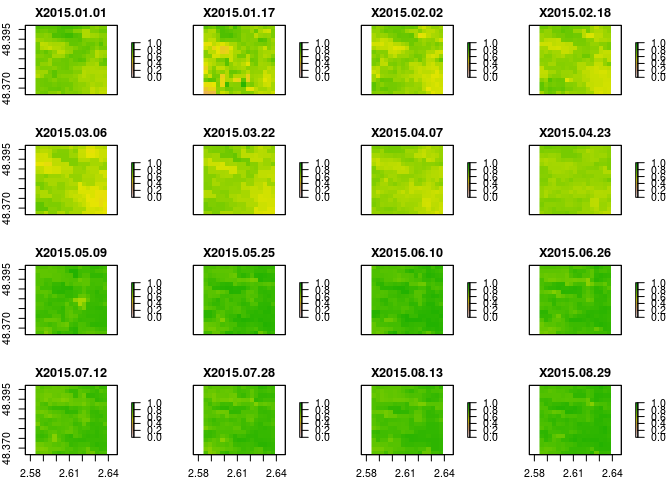
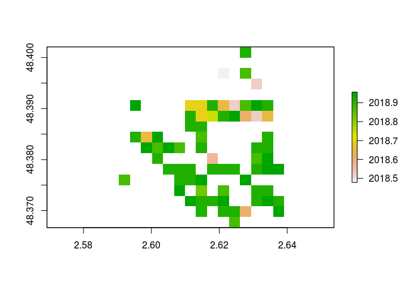

MODISTools - bfast tutorial
================
Koen Hufkens
March 13, 2019

Load required libraries and define custom list to raster function.

``` r
  library(MODISTools, quietly = TRUE)
  library(raster, quietly = TRUE)
  library(bfast, quietly = TRUE)
  library(zoo, quietly = TRUE)

  # custom raster conversion function
  mt_to_raster <- function(df = subset){
  
    # find unique dates for which data should exist
    dates <- unique(df$calendar_date)
  
    # convert scale to 1 if not available
    # should not change the numeric value of a band
    df$scale[df$scale == "Not Available"] <- 1
  
    # loop over all dates, format rasters and return
    r <- do.call("stack",
      lapply(dates, function(date){
  
       # stuff values into raster
       m <- matrix(df$value[df$calendar_date == date] *
                     as.numeric(df$scale[df$calendar_date == date]),
                  df$nrows[1],
                  df$ncols[1],
                  byrow = TRUE)
  
       # convert to raster and return
       return(raster(m))
      })
     )
  
    # get bounding box
    bb <- mt_bbox(
      xllcorner = df$xllcorner[1],
      yllcorner = df$yllcorner[1],
      cellsize = df$cellsize[1],
      nrows = df$nrows[1],
      ncols = df$ncols[1])
  
    # convert to Spatial object (easier to get extent)
    bb <- as(bb, 'Spatial')
  
    # assign extent + projection bb to raster
    extent(r) <- extent(bb)
    projection(r) <- projection(bb)
    names(r) <- as.character(dates)
  
    # return the data
    return(r)
  }

  
  timeser <- function(index, dt) {
    z <- zoo(index, dt)
    yr <- as.numeric(format(time(z), "%Y"))
    jul <- as.numeric(format(time(z), "%j"))
    delta <- min(unlist(tapply(jul, yr, diff))) # 16
    zz <- aggregate(z, yr + (jul - 1) / delta / 23)
    (tso <- as.ts(zz))
    return(tso)
  }
```

The below commands query NDV, quality control data and land cover values for a region around the Fontainbleau forest near Paris.

``` r
# Download modis data around the forest of Fontainbleau
LC <- mt_subset(product = "MCD12Q1",
                lat = 48.383662,
                lon = 2.610250,
                band = "LC_Type1",
                start = "2005-01-01",
                end = "2005-12-30",
                km_lr = 2,
                km_ab = 2,
                site_name = "testsite",
                internal = TRUE,
                progress = FALSE)

VI <- mt_subset(product = "MOD13Q1",
                lat = 48.383662,
                lon = 2.610250,
                band = "250m_16_days_NDVI",
                start = "2015-01-01",
                end = "2018-12-31",
                km_lr = 2,
                km_ab = 2,
                site_name = "testsite",
                internal = TRUE,
                progress = FALSE)

QA <- mt_subset(product = "MOD13Q1",
                lat = 48.383662,
                lon = 2.610250,
                band = "250m_16_days_pixel_reliability",
                start = "2015-01-01",
                end = "2018-12-31",
                km_lr = 2,
                km_ab = 2,
                site_name = "testsite",
                internal = TRUE,
                progress = FALSE)
```

The data as queried above is serialized gridded data, which can be put back together into a data cube using `mt_to_raster()`. Subsetting and masking can then be done using the usual `raster` operations.

``` r
# convert df to raster
VI_r <- mt_to_raster(df = VI)
QA_r <- mt_to_raster(df = QA)
LC_r <- mt_to_raster(df = LC)

# upsample due to lower resolution
LC_r_2x <- resample(LC_r, QA_r, method = "ngb")

# create mask on pixel reliability flag
m <- (QA_r < 0 | QA_r > 1 )

# create land cover mask
lc_m <- !(LC_r_2x == 4 | LC_r_2x == 5)

# combine both masks
VI_m <- mask(VI_r, m, maskvalue = 1)
VI_m <- mask(VI_r, lc_m, maskvalue = 1)
```

Plot the original NDVI maps, and the masked data.

``` r
# plot masked data combining pixel quality
# and showing deciduous and mixed forest pixels
# only (for the Fontainbleau forest area)
plot(VI_m, zlim = c(0,1))
```



Alternatively you can filter the data in the data frame, which would change values in place. The latter does not require conversion to raster first, and is easier.

``` r
# screen for bad pixels the non raster way
# before conversion to raster (actually easier)
VI$value[which(QA$value < 0 | QA$value > 1)] <- NA
```

For all pixels calculate the BFAST breakpoints.

``` r
# list unique pixels
pixels <- unique(VI$pixel)

# get breakpoints for pixels
breakpoints <- do.call("rbind",
 lapply(pixels, function(pixel){
  px <- VI[VI$pixel==pixel,]
  bp <- bfastmonitor(
    timeser(px$value,
            as.Date(px$calendar_date)),
    start = c(2018,4))$breakpoint
  return(bp)
}))

# combine output
output <- data.frame(pixels, breakpoints)

# print stuff
print(head(output))
```

    ##   pixels breakpoints
    ## 1      1          NA
    ## 2      2          NA
    ## 3      3          NA
    ## 4      4          NA
    ## 5      5          NA
    ## 6      6          NA

Convert the breakpoint values to a raster map for visualization.

``` r
# convert to map
m <- matrix(output$breakpoints,
            nrow = nrow(VI_r),
            ncol = ncol(VI_r),
            byrow = TRUE)
r <- raster(m)
projection(r) <- projection(VI_r) # relies on the above maps, caveat!
extent(r) <- extent(VI_r)
plot(r)
```


